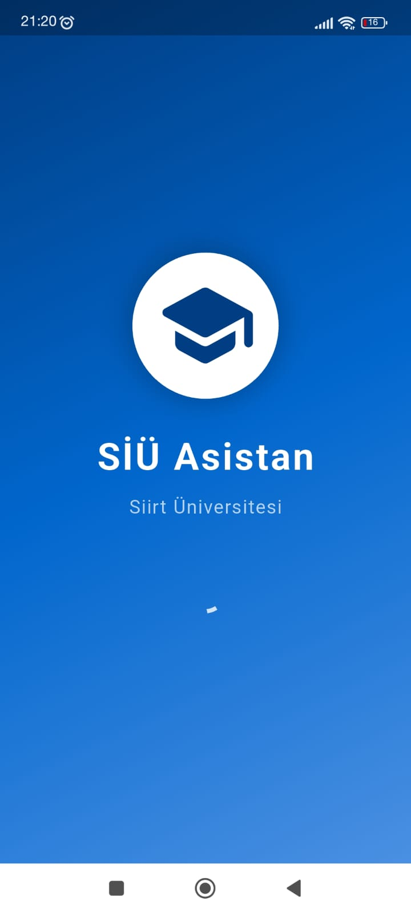
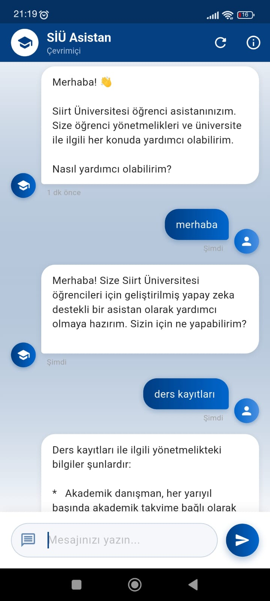
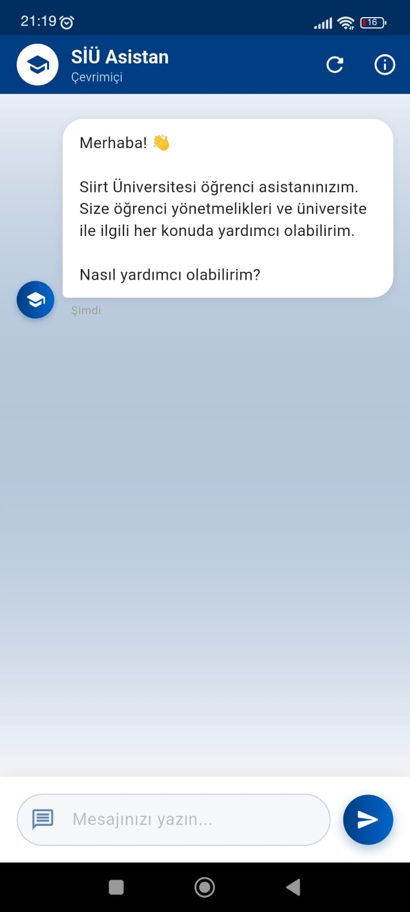

# 📱 SiÜ Asistan - Mobil Uygulama

Siirt Üniversitesi öğrencileri için geliştirilmiş, yapay zeka destekli akıllı asistan mobil uygulaması.

## 📋 Proje Hakkında

SiÜ Asistan, öğrencilerin üniversite yönetmelik ve prosedürleriyle ilgili sorularına anında yanıt veren, modern ve kullanıcı dostu bir mobil chatbot uygulamasıdır. RAG teknolojisi ile desteklenen backend sayesinde güvenilir ve doğru bilgiler sunar.

## ✨ Özellikler

- 💬 **Akıllı Chatbot**: Doğal dil işleme ile soru-cevap
- 🎨 **Modern UI/UX**: Üniversite kurumsal kimliğine uygun tasarım
- ⚡ **Hızlı Yanıt**: Anında ve doğru bilgi erişimi
- 📚 **Kaynak Gösterimi**: Cevapların hangi yönetmelikten geldiğini gösterir
- 🌙 **Dark Mode**: Göz yorucu olmayan karanlık tema
- 💾 **Chat Geçmişi**: Önceki konuşmaları saklama
- 🔍 **Arama**: Geçmiş konuşmalarda arama yapabilme
- 🌐 **Offline Destek**: Sık sorulan sorular için offline çalışma

## 📱 Ekran Görüntüleri

<p align="center">
  
  
  
</p>

## 🛠️ Teknolojiler

- **Flutter 3.x** - Cross-platform framework
- **Dart** - Programming language
- **HTTP** - API communication
- **Provider** - State management
- **Shared Preferences** - Local storage
- **Lottie** - Animations

## 📦 Kurulum

### Gereksinimler

- Flutter SDK 3.0 veya üzeri
- Dart SDK 3.0 veya üzeri
- Android Studio / VS Code
- Android SDK (Android için)
- Xcode (iOS için - Mac gerekli)

### 1. Repoyu Klonlayın

```bash
git clone https://github.com/emrecan_nt/siu-asistan-mobile.git
cd siu-asistan-mobile
```

### 2. Bağımlılıkları Yükleyin

```bash
flutter pub get
```

### 3. Backend API Ayarları

`lib/config/api_config.dart` dosyasını oluşturun:

```dart
class ApiConfig {
  static const String baseUrl = 'http://YOUR_BACKEND_URL';
  static const String askEndpoint = '/api/ask';
}
```

> ⚠️ **ÖNEMLİ:** Backend API URL'nizi buraya ekleyin. Kendi backend'inizi deploy etmek için [backend repo](https://github.com/emrecan_nt/siu-asistan-backend)'ya bakın.

### 4. Uygulamayı Çalıştırın

```bash
# Android Emulator veya cihazda
flutter run

# iOS Simulator'da (Mac gerekli)
flutter run
```

## 📁 Proje Yapısı

```
siu-asistan-mobile/
├── lib/
│   ├── main.dart                 # Ana uygulama
│   ├── config/
│   │   └── api_config.dart      # API yapılandırması
│   ├── models/
│   │   ├── message.dart         # Mesaj modeli
│   │   └── chat_history.dart    # Chat geçmişi modeli
│   ├── providers/
│   │   └── chat_provider.dart   # State management
│   ├── screens/
│   │   ├── splash_screen.dart   # Başlangıç ekranı
│   │   ├── chat_screen.dart     # Ana chat ekranı
│   │   └── history_screen.dart  # Geçmiş ekranı
│   ├── widgets/
│   │   ├── message_bubble.dart  # Mesaj balonu
│   │   ├── typing_indicator.dart # Yazıyor göstergesi
│   │   └── custom_app_bar.dart  # Özel app bar
│   └── services/
│       └── api_service.dart     # API servisi
├── assets/
│   ├── images/                  # Görseller
│   ├── animations/              # Lottie animasyonlar
│   └── fonts/                   # Yazı tipleri
├── android/                     # Android yapılandırması
├── ios/                        # iOS yapılandırması
├── pubspec.yaml                # Bağımlılıklar
└── README.md
```

## 🎨 Tasarım Özellikleri

### Renkler
- **Primary**: `#003366` (Üniversite Mavisi)
- **Secondary**: `#FFB81C` (Üniversite Sarısı)
- **Background**: `#F5F5F5`
- **Text**: `#333333`

### Font
- **Poppins** - Ana yazı tipi

## 🔧 Geliştirme

### Debug Modu

```bash
flutter run --debug
```

### Release Build

**Android APK:**
```bash
flutter build apk --release
```

**Android App Bundle:**
```bash
flutter build appbundle --release
```

**iOS:**
```bash
flutter build ios --release
```

## 📲 Deployment

### Google Play Store

1. `android/app/build.gradle` dosyasında version güncelle
2. Signing yapılandırması yap
3. Bundle oluştur: `flutter build appbundle`
4. Google Play Console'a yükle

### Apple App Store

1. `ios/Runner/Info.plist` dosyasında version güncelle
2. Xcode'da Archive oluştur
3. App Store Connect'e yükle

## 🧪 Test

```bash
# Unit testler
flutter test

# Integration testler
flutter drive --target=test_driver/app.dart
```

## 🤝 Katkıda Bulunma

1. Fork edin
2. Feature branch oluşturun (`git checkout -b feature/yeniOzellik`)
3. Commit yapın (`git commit -m 'Yeni özellik eklendi'`)
4. Branch'i push edin (`git push origin feature/yeniOzellik`)
5. Pull Request oluşturun

## 🐛 Bilinen Sorunlar

- [ ] iOS'ta bazı animasyonlar yavaş çalışabilir
- [ ] Çok uzun mesajlarda scroll sorunu

## 📝 Yapılacaklar

- [ ] Push notification desteği
- [ ] Sesli asistan özelliği
- [ ] Çoklu dil desteği
- [ ] Karanlık mod geliştirmeleri
- [ ] Widget desteği (Android/iOS)


## 🔗 İlgili Projeler

- [Backend API](https://github.com/emrecan_nt/siu-asistan-backend) - RAG destekli backend servisi

## 👨‍💻 Geliştirici

**[Adınız Soyadınız]**
- GitHub: [@kullanici_adiniz](https://github.com/emrecan_nt)
- LinkedIn: [linkedin.com/in/emrecan_nt](https://www.linkedin.com/in/emrecan-nt/)
- Email: emremizrak150@gmail.com

## 📞 Destek

Sorularınız veya önerileriniz için:
- Issue açın
- Pull request gönderin
- Benimle iletişime geçin

## 🙏 Teşekkürler


- Flutter topluluğuna
- Tüm katkıda bulunanlara

---

⭐ Projeyi beğendiyseniz yıldız vermeyi unutmayın!

